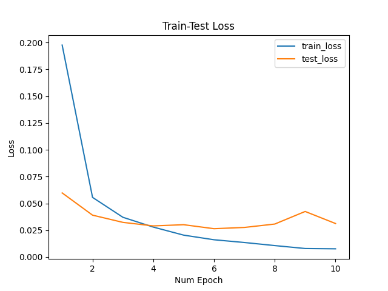

# CYBERPLANT
A computer vision project for autonomous greenhouses

#### Dataset:
Custom

## Experiments
Shared parameters:
```
batch size: 32
Image dimensions (HxW): 224x224 (center-cropped and resized)
Model: Custom (ResNet18 Backbone)
initial learning rate: 1e-3
epochs: 30
```

**Dataset-split**: 10% for Validation
### Experiment 1

|                | **NMSE Loss** |
|----------------|----------------|
| June 7 (prelim) |       0.918 |


<!--  -->
